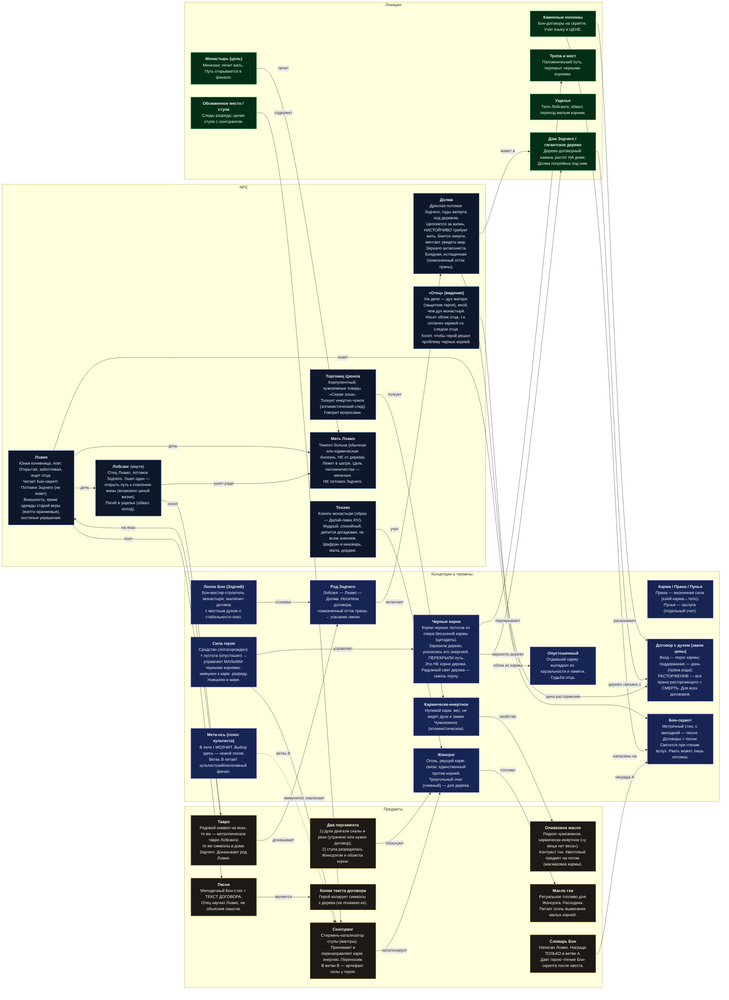

# Квест локации «Монастырь» (Акт I) — повествование, диаграмма, техдокументация

> Документ объединяет три представления одного квеста: (1) историю в порядке открытий игрока; (2) mermaid-диаграммы прохождения и связей элементов; (3) техническую спецификацию для реализации в Unreal Engine 5.7 с плагином FlowGraph. Допущение по невидимости героя в Акте I в этом документе **снято** (взаимодействия описаны как при видимом протагонисте); это будет учтено отдельным проходом.

---

## 1. Квест как рассказ (в порядке открытий игрока)

После того как в черной цитадели сорвался обряд, юноше явился отец. Тот, кого он никогда толком не помнил, все же узнал сердцем. Отец сказал, где его искать, и юноша, не знающий почти ничего ни о мире, ни о себе, бежал из подземелья. Дни в пустошах слились в один, но вскоре тропа повела вверх к заснеженным горным вершинам и буддистскому монастырю, чьи белые ярусы вырастали на отвесных склонах.

Первое, что встречает герой на заснеженных тропах — это каменные колонны. На них вырезаны знаки, которых он не понимает. Они встречаются нечасто, и каждая имеет различные надписи.

Выше по тропе слышится девичьей голос. Поет молодая девушка в ярких одеждах с костяными украшениями — Лхамо, она кочевница. В разговоре с ней открывается ее мир. Она путешествует с отцом, матерью и со стадом краснорогих яков. Ее мать тяжело больна и лежит в шатре не в силах подняться. Они направлялись к монастырю, чтобы получить помощь от монахов, но паломническая тропа оказалась перекрыта. Путь преграждают корни исполинского дерева, выросшего среди скал. Они фантастически черны, а между борозд мерцает радужный свет. Из-за них ни стадо, ни больная мать не могут пройти и получить помощь, и потому отец отправился в обход один за лекарством. Однако, прошло три дня, а он так и не вернулся. Лхамо понимает знаки на колоннах. Это оказывается язык духов Бон. На нем духи и люди заключают договоры, а тексты высекают на таких камнях. Девушка читает один из них вслух, и вырезанные знаки наливаются светом в такт ее словам. В тексте открывается страшная деталь — тот, кто развяжет договор, отдает все дыхание, что в нем осталось. На последок герой замечает на шерсти яков тавро — родовой знак семьи.

Дальше в горах герой встречает корпулентного торговца гильдии Цхонпа. Он направлялся в монастырь, но из-за обрушенного моста, ведущего напрямую к монастырю, был вынужден бросить часть товаров и пойти в обход. Его товары не из этих мест. Среди них герой замечает запечатанный сосуд масла, выжатого из плода, что не растет в этих горах, оливкового. Торговец вертит сосуд в руках и объясняет его природу: у этой вещи нет кармического веса, она пришла извне всех здешних циклов: «Духи такого не видят». Такие вещи большая редкость. Однако, сам торговец говорит больше вопросами, чем ответами.

Тропа приводит к жилым постройкам монахов. От них к монастырю ведет большой мост — и он тоже задушен черными корнями. Здесь живет Тензин, Кхенпо монастыря (духовный наставник, его образ списан с Далай-ламы XIV) — спокойный и мудрый. Монахи ищут способ избавиться от корней, но ни огонь, ни метал им нипочем. Единственное, что может причинить им вред — огненный обряд Жинсрэг, что рвет кармические связи. Тензин показывает герою, как разжечь малый Жинсрэг на масле гхи (масло из молока яков) — этого хватает, чтобы выжечь мелкие корни с дороги. Тензин делится своими мыслями о происхождении этой черной напасти. Зодчий, Бон-мастер, возведший монастырь, когда-то заключил договор с местным духом, и вскоре выросло то огромное дерево, однако, само по себе это древо не разрушало но черные корни, говорит он, появились совсем недавно, и это его тревожит. В монастырской библиотеке находятся два пергамента. Первый: в древнейшую эпоху духи по своей воле двигали целые скалы и меняли русла рек — искусство ныне утраченное, либо требующее теперь договора с человеком. Второй: однажды черные корни подобрались к священной ступе, и та высвободила накопленную кармическую энергию, обжегши окрестности огнем Жинсрэг, — отсюда монахи и заключили, что лишь такой огонь одолевает корни.

По мосту не пройти, и герой спускается в ущелье между скал. Там лежит мертвый мужчина, оплетенный черными корнями. При нем — металлическое тавро, и знак на нем тот же, что метил яков семьи Лхамо. Это Лобсанг, ее отец. Он ушел в обход один; земля под ним обвалилась, другого пути не было, и он замерз. Герой направляет тонкий корень через расселину и переходит там, где не смог отец.

На другой стороне — странное место: скалы будто обожжены ярким пламенем, тут и там на камнях тлеют угли. В центре — разрушенная ступа, изнутри сочится слабый свет. Его излучает сонгсранг, исписанный мантрами стержень ступы. Видимо, это его разряд и обжег здесь все, и подобравшиеся слишком близко корни.

Пробираясь меж отвесных скал и оплетающих их гигантских корней, герой выходит наконец к исполинскому дереву. Оно растет прямо из дома. Малыми корнями герой расчищает путь внутрь. Там живет бледная старуха — Долма. Уже несколько лет она не может выйти: когда дерево разрослось, дом провалился глубже в скалы, и никто из тех, кто оставался внутри, оттуда не выбрался. Она рассказывает о своей жизни. Она живет в доме Зодчего, построившего монастырь. Ее предок заключил с духом договор: дух удерживает скалы в покое, чтобы землетрясения не разрушили обитель; платой стала прана — сама жизненная сила — потомков Зодчего, что взимается из поколения в поколение. Дух пожелал, чтобы слова закрепили не на каменной колонне, а на деревце в ущелье под домом. Дерево выросло таким огромным, потому что стало проводником, несущим прану рода духу. Никто из ее рода не решился разорвать договор — ибо сделавший это заплатит всем достоинством своей жизни; не решается и она. Долма мечтает увидеть внешний мир; она боится смерти; она настойчиво требует жить. А на вещах в ее доме герой видит те самые знаки, что были на тавро Лобсанга.

Поскольку дерево — «договорный камень», на нем записан текст договора. Герой копирует знаки, хоть и не умеет их читать.

Он приносит копию Лхамо. Она читает — и замирает. Этот текст — ее песня, та самая, которой научил ее отец.

Здесь дорога расходится.

Если герой отдает Лхамо тавро, взятое у ее отца, она понимает: она и ее отец — крови Зодчего, а значит, она может разорвать договор. Она поет слова, положив руку на дерево. Пока она поет, черные корни тянутся к ней, и герой должен удерживать их, пока она не закончит. На последнем слове дерево растворяется, и корни вместе с ним, и путь открыт — но Лхамо больше нет. Напоследок она оставляет ему дар: словарь языка духов, написанный ею самой, чтобы он мог читать то, что читала она. Долма, освобожденная, наконец выбирается на воздух. А Лхамо просит героя донести ее больную мать до монастыря, где ту исцеляют.

Если герой выбирает иную дорогу, ему нужно сжечь дерево. Он видел, как монахи справляются с мелкими корнями, — огнем Жинсрэг, — и Тензин показал, как его разжечь, но силы этого огня слишком мало для такого дерева: нужен катализатор. Если герой вспомнит пергамент о ступе, чей стержень разрядился пламенем, и вспомнит целую ступу, что встретил по пути, он может попытаться извлечь ее сонгсранг. Ни одна рука, отягощенная кармой, не коснулась бы накопленного заряда и не уцелела бы — но герой пуст от кармы и потому может его взять, хотя строители никогда не предполагали, что стержень вынут, и сочли бы это осквернением. С сонгсрангом, что примет и перенаправит огонь, герой разжигает гневный Жинсрэг и сжигает дерево. Падая, оно обрушивается на дом Долмы, которая требовала жить, и она гибнет под ним. Путь открыт; Лхамо и ее мать проходят к монастырю, мать — на исцеление, и Лхамо так и не узнает, чью кровь несет. Сонгсранг остается у героя.

Много позже, во втором акте: если Лхамо разорвала договор, герой встречает ее выздоровевшую мать, и та отдает ему одного из своих яков, чтобы дорога была легче. Если герой сжег дерево, он встречает семью, в которой только что родилась девочка — на все вокруг любопытная без меры.

> **Что остается скрытым от игрока на этом уровне** (раскрывается позднее, не входит в повествование Акта I): «отец» в видении — это дух матери, защитник героя, отличный от духа монастыря; он носит облик отца, потому что мать оплатила договор накопленной кармой, в которой был и кармический след отца — отец добровольно отдал свою карму ради этого договора и стал Опустошенным, исчезнув из мира. Болезнь матери Лхамо не связана с природой дерева — дерево лишь перекрывает единственный путь к лечению и губит ее застреванием в горах. Выбор на этом уровне — «немой посев»: голос культиста в Акте I молчит, но ветвь сожжения (попрание чужой воли, осквернение, убийство, обретение орудия силы) питает культистский/негативный финал, а ветвь расторжения ему противостоит.

---

## 2. Диаграммы (mermaid)

Для читаемости квест разнесен на две диаграммы: **2.1 Флоу прохождения** (последовательность, точка решения, две ветви, схождение, последствия Акта II) и **2.2 Граф элементов** (каждый элемент — блок с описанием; связи между элементами).

### 2.1 Флоу прохождения

```mermaid
flowchart TD
  classDef beat fill:#1f2937,stroke:#9ca3af,color:#f9fafb;
  classDef decision fill:#7c2d12,stroke:#fdba74,color:#ffffff;
  classDef branchA fill:#064e3b,stroke:#6ee7b7,color:#ecfdf5;
  classDef branchB fill:#3b0764,stroke:#d8b4fe,color:#faf5ff;
  classDef outcome fill:#0c4a6e,stroke:#7dd3fc,color:#f0f9ff;

  S0["Видение «отца» (на деле — дух матери)<br/>цель: найти отца, идти к монастырю"]:::beat
  S1["Побег из цитадели, пустоши,<br/>окрестности монастыря"]:::beat
  S2["Каменные колонны<br/>непонятный Бон-скрипт"]:::beat
  S3["Встреча с Лхамо<br/>кочевники, больная мать, краснорогие яки, тавро,<br/>заблокированная тропа, гигантское дерево и черные корни,<br/>отец ушел в обход. Чтение колонны вслух → скрипт светится →<br/>игрок узнает ЦЕНУ договора (жизнь)"]:::beat
  S4["Торговец Цхонпа<br/>инертно-чужое; герой находит оливковое масло"]:::beat
  S5["Жилища монахов, мост (задушен черными корнями)"]:::beat
  S6["Тензин (Кхенпо)<br/>Жинсрэг + гхи = выжигание малых корней (обучение верба);<br/>договор первого Зодчего; «корни появились недавно» (ключ)"]:::beat
  S7["Библиотека: 2 пергамента<br/>(духи двигали скалы; ступа разрядилась Жинсрэгом)"]:::beat
  S8["Ущелье: тело Лобсанга в корнях + металлическое тавро<br/>(= отец Лхамо). Переход через расселину малым корнем"]:::beat
  S9["Обожженное место: разрушенная ступа,<br/>свет = сонгсранг"]:::beat
  S10["Гигантское дерево на доме → Долма<br/>договор, цена-прана, дерево = договорный камень,<br/>символы в доме = тавро. Копирование текста договора"]:::beat
  S11["Возврат к Лхамо: показ текста →<br/>песня Лхамо = текст договора"]:::beat
  D{"РЕШЕНИЕ<br/>отдать тавро Лхамо<br/>или пойти силой?"}:::decision

  subgraph BA["Ветвь A — Расторжение (непривязанность)"]
    A1["Отдать тавро → Лхамо узнает род →<br/>может расторгнуть договор"]:::branchA
    A2["Лхамо поет у дерева; герой защищает ее<br/>от тянущихся корней (таймер-песня)"]:::branchA
    A3["Дерево РАСТВОРЯЕТСЯ; черные корни спадают;<br/>тропа открыта"]:::branchA
    A4["Лхамо ГИБНЕТ; оставляет словарь Бон;<br/>Долма ОСВОБОЖДЕНА; герой несет мать → менкханг (исцеление)"]:::branchA
  end

  subgraph BB["Ветвь B — Сожжение (сила, накопление)"]
    B1["Вспомнить ступу + пергамент + метод Тензина"]:::branchB
    B2["Извлечь сонгсранг из целой ступы<br/>(иммунитет героя; ОСКВЕРНЕНИЕ)"]:::branchB
    B3["Жинсрэг (треугольный очаг) + сонгсранг-катализатор →<br/>СЖЕЧЬ дерево"]:::branchB
    B4["Дерево падает на дом → Долма ГИБНЕТ (требовала жить);<br/>тропа открыта; Лхамо жива (в неведении);<br/>мать → менкханг; сонгсранг остается у героя"]:::branchB
  end

  C0["Тропа к монастырю свободна → герой идет дальше (Акт II)"]:::beat
  OA["Акт II (после A): выздоровевшая мать дарит яка"]:::outcome
  OB["Акт II (после B): семья с любопытной новорожденной<br/>(перерождение Долмы)"]:::outcome

  S0-->S1-->S2-->S3-->S4-->S5-->S6-->S7-->S8-->S9-->S10-->S11-->D
  D-- "отдал тавро" -->A1
  D-- "выбрал силу" -->B1
  A1-->A2-->A3-->A4-->C0
  B1-->B2-->B3-->B4-->C0
  C0-->OA
  C0-->OB
  A4-. "флаг A" .->OA
  B4-. "флаг B" .->OB
```

### 2.2 Граф элементов (блоки с описаниями и связями)

---

## 3. Техническая документация (UE 5.7 + FlowGraph)

> Допущения по версиям: FlowGraph (MothCocoon) — узловой граф нарратива; базовые узлы `UFlowNode` (Start, ExecutionSequence, ExecutionMultipleNodes, Notify, SubGraph). Стандартная практика — собственные узлы (`UFlowNode`-наследники) под доменную логику; в проекте такие узлы помечены префиксом `FN_`. Условные ветвления реализуются собственными узлами-условиями, читающими игровое состояние. Конкретные имена API уточнить под фактическую версию плагина.

### 3.1 Архитектура

- **Корневой Flow Asset** квеста: `FA_Q01_Monastery`. Запускается `UFlowComponent` на акторе-распорядителе уровня (`BP_QuestDirector`) при входе в зону монастыря.
- **Подграфы** (узел `SubGraph`) для изоляции и параллельной разработки:
    - `FA_Q01_Approach` — видение, прибытие, колонны, Лхамо.
    - `FA_Q01_Ascent` — торговец, монахи/Тензин, библиотека.
    - `FA_Q01_Ravine` — ущелье, тело Лобсанга, переход.
    - `FA_Q01_Core` — обожженное место, дерево, Долма, копия договора, возврат к Лхамо.
    - `FA_Q01_Branch_Dissolve` (A) и `FA_Q01_Branch_Burn` (B).
    - `FA_Q01_Resolve` — схождение, выход в Акт II.
- **Состояние и сохранение.** Локальное состояние графа — через `UFlowSaveGame` (сохранение/загрузка пинов). **Межуровневые** флаги последствий (для Акта II) дублируются в `UQuestSubsystem` (GameInstance Subsystem) и пишутся в `USaveGame`, т.к. подграф Акта I выгрузится при смене уровня (см. 3.9).
- **Источник истины для условий** — `UQuestSubsystem` (через него FlowGraph читает и пишет флаги; узлы не хранят бизнес-данные сами).

### 3.2 Фазы квеста (enum) и задачи

`EQ01_Phase` (uint8): `None, Approach, MetLhamo, Merchant, Monks, Library, Ravine, BurntSite, MetDolma, ContractCopied, ShownToLhamo, BranchChosen, Resolved`.

Видимые задачи (objective text по фазам):

- Approach: «Добраться до монастыря по горной тропе».
- MetLhamo: «Узнать, почему перекрыта паломническая тропа».
- Monks/Library: «Найти у монахов способ убрать черные корни».
- Ravine: «Найти обход к дереву».
- MetDolma: «Узнать природу дерева и договора».
- ShownToLhamo: «Решить судьбу договора».
- BranchChosen: контекстная задача ветви.

### 3.3 Переменные состояния (источник — `UQuestSubsystem`)

|Имя|Тип|Default|Кто ставит|Кто читает|
|:--|:--|:--|:--|:--|
|`Phase`|EQ01_Phase|None|узлы фаз|задачи, UI, условия|
|`bMetLhamo`|bool|false|диалог Лхамо|условия|
|`bReadColumnCost`|bool|false|чтение колонны вслух|подача цены, условия A|
|`bMetMerchant`|bool|false|диалог торговца|—|
|`bHasOliveOil`|bool|false|подбор предмета|инвентарь (на потом)|
|`bMerchantExplainedInert`|bool|false|диалог торговца|кодекс|
|`bMetTenzin`|bool|false|диалог Тензина|—|
|`bKnowsJinsregMethod`|bool|false|обучение у Тензина|верб выжигания, условие B|
|`bReadScroll_Spirits`|bool|false|пергамент 1|кодекс|
|`bReadScroll_Stupa`|bool|false|пергамент 2|условие B (подсказка)|
|`bSawIntactStupa`|bool|false|вход в обожженное место|условие B (подсказка)|
|`bHasTavro`|bool|false|подбор у тела Лобсанга|условие A|
|`bMetDolma`|bool|false|диалог Долмы|условие выбора|
|`bContractCopied`|bool|false|взаимодействие с деревом|ShownToLhamo|
|`bShownContractToLhamo`|bool|false|диалог (ревелейшен песни)|разблокировка выбора|
|`bGaveTavroToLhamo`|bool|false|действие выбора A|старт ветви A|
|`Choice`|EQ01_Choice|None|узел развилки|резолв, Акт II|
|`bSongsrangExtracted`|bool|false|взаимодействие со ступой (B)|старт сожжения|
|`bTreeDissolved`|bool|false|конец A|открытие тропы|
|`bTreeBurned`|bool|false|конец B|открытие тропы|
|`bDolmaFreed`|bool|false|конец A|NPC-состояние|
|`bDolmaDead`|bool|false|конец B|мета-ось, Акт II|
|`bLhamoDead`|bool|false|конец A|мета-ось, Акт II|
|`MetaCultistDelta`|int32|0|узлы трансгрессий (B)|мета-система|
|`bHasSongsrangItem`|bool|false|конец B|инвентарь, поздние акты|
|`bHasBonDictionary`|bool|false|конец A|чтение Бон-скрипта позже|

`EQ01_Choice` (uint8): `None, Dissolve, Burn`.

### 3.4 Узлы FlowGraph по фазам

Шаблон каждой фазы: **триггер** (`FN_OnInteract` / `FN_OnBeginOverlap`) → **действия** (`FN_Dialogue`, `FN_SetFlag`, `FN_SetPhase`, `FN_WorldState`, `FN_GrantItem`, `FN_PlayVFX`) → выход к следующей фазе. Старт графа — `Start` → `SubGraph(Approach)`.

Собственные узлы (спецификации):

- `FN_Dialogue` — вход: `DialogueAsset`, `SpeakerTag`; выход: `OnFinished`, опционально именованные выходы по веткам реплик. Внутри вызывает диалоговую систему, по завершении дергает выход.
- `FN_SetFlag` / `FN_SetPhase` — пишут в `UQuestSubsystem`; синхронный, один выход.
- `FN_Condition` — читает `UQuestSubsystem`; N именованных выходов (`True/False` или перечисление). Используется на развилке и для подсказок.
- `FN_WorldState` — вход: `Operation` (Spawn/Despawn/Toggle), цель (`RootClusterTag`, `BridgeTag`, дверь дома и т.д.). Меняет мир (например, despawn кластера корней при открытии тропы).
- `FN_GrantItem` / `FN_RemoveItem` — инвентарь (тавро, масло, словарь, сонгсранг).
- `FN_PlayVFX` / `FN_PlaySequence` — Niagara/Level Sequence (растворение дерева, обрушение, свечение скрипта).
- `FN_GateAbility` — вкл./выкл. игровой верб (выжигание корней) по флагу.

Ключевые фазовые сцепки:

- **Approach → MetLhamo:** `FN_OnInteract(Lhamo)` → `FN_Dialogue(DLG_Lhamo_Intro)` → `FN_SetFlag(bMetLhamo)`. Параллельно объект «колонна»: `FN_OnInteract(Column)` (если рядом Лхамо или после знакомства) → `FN_PlayVFX(ColumnGlow)` + `FN_Dialogue(DLG_Lhamo_ReadsCost)` → `FN_SetFlag(bReadColumnCost)`.
- **Monks:** `FN_Dialogue(DLG_Tenzin)` → `FN_SetFlag(bMetTenzin)`; ветка обучения → `FN_SetFlag(bKnowsJinsregMethod)` + `FN_GateAbility(JinsregBurn, On)`.
- **Ravine:** `FN_OnInteract(LobsangBody)` → `FN_GrantItem(Tavro)` + `FN_SetFlag(bHasTavro)` + `FN_Dialogue(DLG_Internal_Deduction)`; переход через расселину — игровой верб (см. 3.7), по успеху `FN_SetPhase(BurntSite)`.
- **Core:** вход в обожженное место → `FN_SetFlag(bSawIntactStupa)`; дерево/дом → `FN_WorldState(ClearInteriorRoots)` (через верб) → `FN_Dialogue(DLG_Dolma)` → `FN_SetFlag(bMetDolma)`; взаимодействие с деревом → `FN_PlayVFX(ContractGlow)` + `FN_GrantItem(ContractCopy)` + `FN_SetFlag(bContractCopied)`.
- **ShownToLhamo:** условие `FN_Condition(bContractCopied && bMetLhamo)` → `FN_Dialogue(DLG_Lhamo_SongReveal)` → `FN_SetFlag(bShownContractToLhamo)` → разблокировка развилки.

### 3.5 Логика развилки

Развилка — НЕ выбор реплики, а действие (см. дизайн «дилемма, не меню»). После `bShownContractToLhamo` доступны два взаимоисключающих действия:

- **Действие A (Dissolve):** интеракт «отдать тавро Лхамо» доступен при `bHasTavro`. По выполнению: `FN_SetFlag(bGaveTavroToLhamo)`, `Choice = Dissolve`, старт `SubGraph(Branch_Dissolve)`.
- **Действие B (Burn):** интеракт «извлечь сонгсранг» у целой ступы доступен при `bSawIntactStupa && bReadScroll_Stupa && bKnowsJinsregMethod`. По выполнению: `FN_SetFlag(bSongsrangExtracted)`, `MetaCultistDelta += W_desecration`, `Choice = Burn`, старт `SubGraph(Branch_Burn)`.

Узел `FN_Condition` на входе развилки блокирует второе действие после выбора первого (необратимость). Если игрок начал собирать B (извлек сонгсранг) — действие A скрывается, и наоборот.

**Ветвь A (`FA_Q01_Branch_Dissolve`):** `FN_Dialogue(DLG_Lhamo_Lineage)` → запуск сегмента защиты: `FN_PlaySequence(LhamoSings)` + спавн волн корней (`FN_WorldState(SpawnRootWaves)`), игрок отражает их вербом; таймер = длительность песни. По завершению без провала: `FN_PlayVFX(TreeDissolve)`, `FN_SetFlag(bTreeDissolved, bDolmaFreed, bLhamoDead, bHasBonDictionary)`, `FN_GrantItem(BonDictionary)`, `FN_WorldState(OpenPath)`, сегмент «донести мать» → `FN_SetPhase(Resolved)`.

**Ветвь B (`FA_Q01_Branch_Burn`):** требует `bSongsrangExtracted`. Интеракт у дерева «разжечь Жинсрэг (треугольный очаг)» с домом Долмы в кадре → `FN_PlaySequence(TreeBurnCollapse)`, `FN_SetFlag(bTreeBurned, bDolmaDead)`, `MetaCultistDelta += W_murder`, `FN_GrantItem(SongsrangItem)` + `FN_SetFlag(bHasSongsrangItem)`, `FN_WorldState(OpenPath)` → `FN_SetPhase(Resolved)`.

`W_desecration`, `W_murder` — настраиваемые веса мета-оси (data asset).

### 3.6 Триггеры, тома, взаимодействия

- NPC и объекты несут `UInteractionComponent`; по интеракту бросают gameplay-событие, на которое подписан соответствующий `FN_OnInteract`.
- Переходы фаз/локаций — `UBoxComponent`/`Trigger Volume` → `FN_OnBeginOverlap`.
- Объект «дерево» имеет два состояния интерактов: «копировать договор» (всегда после доступа) и «разжечь Жинсрэг» (только при `bSongsrangExtracted`).
- Кластеры корней — отдельные акторы с тегами (`RootCluster_Bridge`, `RootCluster_Interior`, `RootCluster_Ravine`), управляются `FN_WorldState`.

### 3.7 Игровые вербы и способности

Реализовать через Gameplay Ability System или простые ability-компоненты; FlowGraph только гейтит доступность и слушает результат.

- **Выращивание малого корня (врожденное):** конструктивный верб (перебросить корень через расселину/зазор). В Акте I — только малые/недавние корни (теги `RootSmall`). Доступен с начала уровня.
- **Выжигание малых корней (Жинсрэг + гхи):** деструктивный верб; доступен после `bKnowsJinsregMethod` (`FN_GateAbility`). Расходует ресурс «гхи» (пополняется в монастыре). Действует на `RootSmall`/`RootMedium`; на `RootMassive` (сросшиеся с праной дерева) — нет.
- **Извлечение сонгсранга:** интеракт-способность, доступная герою всегда (он кармически пуст). Семантически — эксплойт иммунитета к разряду; для прочих NPC недоступен. Триггерит ветвь B.

Свойство-тег героя `Tag.Karma.Empty` (в Акте I всегда активен) — гейт для извлечения сонгсранга и иммунитета к карм. разряду. После Акта II (обретение каузальности) тег снимается — это будущий разлом, не Акт I.

### 3.8 VFX / Audio хуки

- Черные корни: Niagara, черная масса с радужным подсветом «сквозь» (для дерева). Состояния spawn/despawn/recede.
- Свечение скрипта (колонна/дерево) при чтении вслух — `FN_PlayVFX(ColumnGlow/ContractGlow)`, привязка к диалоговому событию.
- Растворение дерева (A) — Level Sequence + Niagara; синхрон с финалом песни (audio-driven маркеры в секвенции).
- Обрушение/сожжение (B) — Level Sequence (треугольный очаг, гневный визуал; обрушение на дом).
- Лейтмотив песни Лхамо — диегетический аудио-компонент на акторе Лхамо с первой сцены; полное исполнение в ветви A как таймер сегмента защиты (длительность = длина трека). Колбэк в Акте II — опционально (флаг).

### 3.9 Межуровневая персистентность (Акт II)

- В `Resolve` записать в `UQuestSubsystem` и `USaveGame` поля: `Choice`, `bLhamoDead`, `bDolmaDead`, `bDolmaFreed`, `bHasSongsrangItem`, `bHasBonDictionary`, `MetaCultistDelta`.
- Уровень Акта II при загрузке читает `Choice`:
    - `Dissolve` → спавн «выздоровевшей матери», выдача яка (`FN_GrantItem(Yak)`), завязанная на `bLhamoDead`.
    - `Burn` → спавн семьи с новорожденной (метка `Reincarnation_Dolma`).
- Мета-система Акта II читает `MetaCultistDelta` для активации голоса культиста, ретроспективно ссылающегося на выбор.

### 3.10 Достижимость ветвей и защита от софтлоков

- Ветвь B заперта знанием (`bSawIntactStupa`, `bReadScroll_Stupa`, `bKnowsJinsregMethod`). Все три флага достижимы на основном пути до встречи с Долмой. После `bMetDolma`, если `Choice == None` и игрок не начал A, по таймеру/реплике выдать подсказку-задачу «огонь, что справился с корнями у ступы…» (мягкий гейт открытия ветви B), не раскрывая решение прямо.
- Информированность выбора: показ цены гарантируется флагом `bReadColumnCost` (получаем при чтении колонны до дерева) и репликами Долмы; перед действием A — подтверждающая реплика о необратимости и цене.
- Необратимость: после старта любой ветви второе действие скрывается (`FN_Condition` по `Choice` и по `bSongsrangExtracted`/`bGaveTavroToLhamo`).
- Известная асимметрия наград: словарь Бон (чтение скрипта) выдается только в ветви A; если Бон-грамотность потребуется в поздних актах для прохождения, предусмотреть альтернативный источник для игроков ветви B (например, у монахов). Отметить в бэклоге.

### 3.11 Открытые места для уточнения при имплементации

- Точные имена узлов/пинов FlowGraph под фактическую версию 5.7-плагина.
- Решение по «краснорогим якам»: канонизировать как породу Бон-кочевников либо привести к канону маунта (белая шерсть, золотые рога) — влияет на ассеты яков и тавро.
- Поздняя роль оливкового масла (маскировка кармы) — спецификация в документации соответствующего акта.