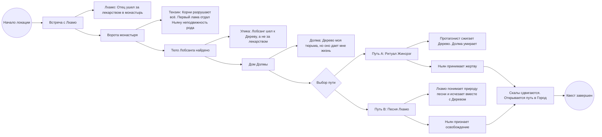

Помоги мне завершить квест для локации в первом акте «монастырь». Как опытные квест дизайнер со стажем работы в крупных нарративных играх проанализируй текущий потенциал квеста для моей игры. Предложи свои конкретные улучшения и заполнения не решенных вопросов. Не пиши очевидные вещи (вроде тех мест, где я сам пишу, что есть незакрытые вопросы). Думай широко, перед тем как отвечать, анализируй свой ответ, и проверь, отвечает ли он заданным условиям. Я хочу интересный квест в стиле (стиль имеется в виду подход к разработке) игр с признанными игроками интересными историями и квестами

Охранительный дух, связанный договором матери, ведёт протагониста. В каждой локации герой получает новый ориентир. Дух не представляется духом — он представляется отцом протагониста. Обманывает его. Цель игрока на этой локации: найти Ньяна. --- Первой он встречает девушку Лхамо, напевающую красивую песню. Она кочевница, за ее семьей следует стадо краснорогих яков. Добродушная, приятная — игрок успевает привязаться к ней. Умная, очень внимательная, с добрым сердцем и чистыми намерениями. При этом не слишком доверчивая: она не бросается рассказывать незнакомцу о своих бедах. Знакомство происходит постепенно, в ходе одного разговора. Её мать больна и лежит неподалёку в шатре. Отец ушёл три дня назад за лекарством в монастырь буддистов. Умеет читать Бон-скрипт: отец учил её с детства. Это редкий навык. С детства она знает песню, которой тоже учил её отец. Она знает каждое слово и разбирала каждое до последнего смысла. Смысл казался ей одним. Когда она поймёт суть своего происхождения — песня приобретёт другой смысл. Эта песня станет её предсмертной песней. --- Следующий — Тензин, у ворот монастыря. Его образ списан с Далай-Ламы XIV. Он видит чёрные корни. Они оплетают горы, мосты, разрушают дороги. Но природа этого явления ему не до конца понятна. Делится предысторией монастыря: что первый лама-зодчий выбрал это место для строительства и спроектировал архитектуру монастыря. А также заключил договор с духом Ньяном. В давние времена, духи могли по своему желанию двигать скалы (аллюзия на землетрясения) и управлять полноводностью рек. Договор обязывал Ньяна удерживать в стабильном состоянии скалы. *[Нерешено: что давал взамен зодчий]*. Тензин не знает подробностей договора, но отмечает, что после его заключения из дома ламы начало немыслимо быстро расти необычное дерево. И выросло огромных размеров. Издалека оно едва напоминает цветок лотоса Он знает ритуал Жинсрэг. *[Нерешено: как именно возникает повод для этого разговора.]* В монастырских записях хранится правильная последовательность выстраивания столбов нагов для перемещения скал. Это опциональная подсказка — найдёт игрок или нет. --- Потом — тело Лобсанга. Лобсанг знал о своём происхождении. Он потом ламы-зодчего. Его дед (сын ламы-зодчего) покинул дом отца приняв кочевой образ жизни, не желая исполнять условия договора с духом. Жене и дочери не говорил. Именно поэтому они оказались в этом месте. Именно поэтому он ушёл — не за лекарством, а чтобы разорвать договор самостоятельно. Корни дерева-договора, отравленные черными корнями разрослись очень далеко, разрушил мост, ведущий к монастырю. Поэтому, лекарства для жены не получить. И поэтому Лобсанг решил пожертвовать собой, чтобы уничтожить корни дерева, мешающие добраться до монастыря. Но об этом (о цели Лобсанга) герой узнает после того, как догадается, что Лзамо — наследница зодчего) По положению тела и направлению падения видно: он шёл к дереву, не к монастырю. Бон-скрипту он учил Лхамо потому, что надеялся: когда-нибудь ей придётся столкнуться с фамильным наследием. При нём есть предмет. *[Нерешено: что именно за предмет. Нужен предмет, который не нарушает логику. Вопрос открыт.]* --- Последняя — Долма. Внучка ламы-зодчего. Дочь брата деда Лобсанга. Старая женщина. дом ламы и в котором она живет (это один и тот же дом) провалился в скалу. Чёрные корни Лотоса окружают его. Они опасны для всех, кроме протагониста. Долма не может выйти. Прямо из дома, оплетая его корнями растёт гигантское дерево. Протагонист входит: корни расступаются перед ним, потому что он лотосорождённый, — но стоит оказаться внутри, они снова смыкаются. Она читает книги. Ведёт записи о прекрасном внешнем мире, который давно не видит. Все остальные члены семьи умерли. Никто из них не решился разорвать договор — потому что расторжение подразумевает смерть того, кто расторгает договор. Расторгнуть могут только потомки ламы-. Долма дожила до старости потому, что дерево питает её карму. Дерево — её тюрьма и её спасение. Она боится смерти. Хочет жить. Это её привязанность — простая, человеческая, привязанность старика к жизни. Возможно, из-за того, что из-за дерева дом просел в скалу, выход из дома оказался заблокирован. Поэтому она не могла больше наслаждать миром. Это должно сделать понятным ее желание жить. Но никто из родственников не решился разорвать договор с ньяном, чтобы дерево исчезло, потому что сделавший это умер. Не из-за наказания, а из-за природы кармического баланса. Такой парадокс. Вся семья жила в доме ловушке, и постепенно все умерли от старости, боясь потерять жизнь и по этом волоча бессмысленное существование. Долма ни слова не говорит об ушедшей ветви рода. Игрок доходит до этого сам, как в детективе. --- Договор с Ньяном *[Нерешено: условия договора нужно строить на реальной религии Бон — что люди считали нужным духам, что им приносили, как договаривались. Все ранее предложенные варианты отклонены.]* Дерево — договорной камень. Растёт само по себе: никакого ухода не требует. Это документ, на котором зафиксировано соглашение. Расторгнуть договор может любой кровный потомок Зодчего. Обычно, для заключения договора используются простые каменные таблички. *[Нерешено: почему договор был заключен именно на дереве. Была мысль, что рядом с домом зодчего росло маленькое дерево. Дух решил скрепить договор записав его условия на коре деревца. Они приобрело каузальную природу и поэтому выросло таким огромным.]* --- Когда Лхамо читает договор, в тексте есть нечто, что указывает на её связь с родом Зодчего. *[Нерешено: что конкретно написано в договоре, что даёт игроку понять это.]* Никто не говорит ей об этом прямо. Никто не говорит об ушедшей ветви. Игрок и Лхамо доходят до этого сами. Когда Лхамо понимает суть своего происхождения — слова песни, которую она знала всю жизнь, складываются по-другому. Возможно, для расторжения договора одних слов недостаточно: нужен ещё какой-то предмет. *[Нерешено какой предмет. Этот предмет должна хорошо знать Лхамо и этот предмет был у трупа ее отца, когда герой его нашел.]* Лхамо принимает решение о жертве не сразу после того, как узнаёт о своём происхождении. Нужен отдельный триггер. *[Нерешено: что именно становится этим триггером.]* --- Есть два пути. **Путь A.** Дерево сжигают огнём Жинсрэг. Обычный огонь дерево не берёт — оно имеет кармическую природу. Огонь мудрости из ритуала Жинсрэг воздействует именно на кармическую природу. Когда дерево сгорает, Долма теряет кармическое питание, которым оно её снабжало, и умирает. Дерево поддерживало ее долголетие, но было при этом клеткой. Перед этим Долма проходит через положительную арку: она должна принять свою старость и смерть, перестать цепляться за жизнь. **Путь B.** Лхамо произносит слова песни — теперь как ритуал расторжения. Возможно, при этом нужен и предмет. *[Нерешено.]* Дерево исчезает. Лхамо исчезает вместе с ним. Протагонист ведёт мать Лхамо и стадо к монастырю. Долма выживает --- После разрешения ситуации с деревом Ньян появляется. В пути A и пути B его появление выглядит по-разному. В обоих случаях он даёт протагонисту следующий ориентир. --- Вдоль тропы — каменные столбы-пьедесталы со статуями многоголовых змей нагов. Символ давней способности духов двигать горы и повелевать землёй. Если активировать корни древних растений у оснований столбов в правильной последовательности, скалы, блокирующие тропу, сдвинутся. Записи Тензина содержат эту последовательность — находить их не обязательно, игрок может решить загадку сам.

позже я получил такой фидбек:
## Фактические проверки

**Ньяны (Гнян) в тибетской мифологии** Подтверждено. Гнян (gnyan, транслитерируется также как нян, ньян, нен) — реальная категория духов в Бон-космологии и тибетской мифологии. Один из 18 классов богов и демонов. Населяют скалы, деревья, горные территории. Вызывают болезни (преимущественно лёгочные) при нарушении их присутствия. Используется в документации без изменений.

**Причина надписи на дереве** Прозаическая: конкретный Ньян был связан с тем деревом как местом своего присутствия. В Бон-традиции духи локализованы — они обитают в конкретных скалах, деревьях, водоёмах. Когда Зодчий искал контакт с Ньяном, тот проявился через это дерево. Договор записан на коре потому, что именно здесь дух был доступен для заключения соглашения. Никакого слияния духа с деревом — поверхность использована как доступный носитель в точке контакта.

---

## Плата за договор

Зодчий передал Ньяну накопленную заслугу (пунью) — единовременный и необратимый трансфер. Не возобновляемое обязательство, не сезонная служба. Трансфер пуньи от практика уровня главного ламы — огромная ставка. Это объясняет масштаб обязательства: Ньян выполняет своё условие (держит горы стабильными) пока договор активен, и не требует ничего сверх полученного.

Договор остаётся в силе не потому что требует обслуживания, а потому что это формальное соглашение, которое должно быть формально расторгнуто. Пока этого не произошло — оба обязательства действуют.

Тематически это работает само по себе: Зодчий израсходовал накопленный духовный капитал на материальный проект. Он торговал трансцендентным ради архитектуры. Форма привязанности.

---

## Механизм раскрытия происхождения Лхамо

Договор заключён до раздела семьи — в тексте нет ветвей, имён будущих детей, упоминания тех, кто ушёл.

Работают два независимых признака, которые сходятся одновременно:

**Первый — клан-символ** Договор скреплён личной печатью Зодчего — символом его рода. Лобсанг, узнав своё происхождение, начал использовать этот знак как тавро для яков. Не в качестве зашифрованного послания — это его способ молчаливого признания наследия, о котором он не мог говорить. Лхамо выросла с этим знаком как с «отцовским тавром». Когда она видит тот же символ на фрагменте коры, который приносит протагонист, она его немедленно узнаёт.

Момент: «Это отцовский знак. Откуда он здесь?»

**Второй — формула расторжения совпадает с её песней** Текст договора содержит ритуальную формулу расторжения. Лхамо читает текст и видит слова, которые знает наизусть с детства — в точности. Её отец учил её этой песне как формуле, не объясняя зачем. Именно поэтому учил Бон-скрипту — чтобы она могла прочитать и понять, когда придёт время.

Оба признака вместе устанавливают: кто она (символ), и что она может сделать (формула).

---

## Откуда Лобсанг знал о своём происхождении

Во время торговых маршрутов он встретил Бон-практика, который в ходе диагностики по пульсу или гадания зафиксировал специфическую кармическую метку рода. Назвал имя. Лобсанг расспросил. Получил достаточно, чтобы искать источник самостоятельно.

Он нашёл дерево. Скопировал текст договора с коры. Нанял или нашёл кого-то, умеющего читать Бон-скрипт, чтобы понять содержание. Из текста узнал формулу расторжения, но не знал, что уже давно обучил ей дочь.

Семье — ни слова. Жене — ничего. Дочери — всё необходимое, без объяснений.

Лобсанг шёл к дереву в последний раз намеренно. Он знал, что расторжение потребует жертвы. Он не знал, что песня, которой учил Лхамо — это и есть формула. Он думал, что должен выучить её сам. Не успел.

---

## Долма: устная традиция и её неточность

Долма не читает Бон-скрипт. В её семье условия договора передавались устно, из поколения в поколение. Когда протагонист приносит ей фрагмент коры, она не может его прочитать. Если он приводит к ней Лхамо — та читает вслух.

**Конкретная неточность устной традиции:** Долма убеждена, что расторжение договора требует одновременного присутствия _всех живых потомков_ рода. Именно поэтому семья никогда не действовала: потомки разошлись, связь потеряна, условие казалось невыполнимым. В тексте договора этого нет. Достаточно одного потомка с формулой на месте заключения.

Семья Долмы десятилетиями жила в ловушке из-за неточности при передаче. Это не злой умысел — просто деградация информации через поколения.

---

## Разговор протагониста с Долмой

Долма спрашивает о мире снаружи. Протагонист почти ничего не знает — большую часть жизни он провёл в цитадели культистов.

Долма воспринимает его ответы как намеренное уклонение. Она наблюдала за ближайшей округой через окно дольше, чем он жил. Она знает каждую деталь видимого пространства лучше любого живого человека, который мог бы мимо пройти. Когда незнакомец, пришедший снаружи, не может ответить на элементарные вопросы об очевидных вещах — это выглядит как ложь.

Конфликт: он искренне не знает, она убеждена что он скрывает.

Разрыв: он говорит о закрытых пространствах — о цитадели, о ритуалах, о темноте. Это не картина мира, которую она строила. Постепенно до неё доходит, что пришедший снаружи знает меньше о её мире, чем она — потому что он тоже никогда в нём не был. Он знал только то, что видел в своей клетке. Она — только то, что видела в своей.

Это точка, где конфликт может сдвинуться: не разрешение, не примирение, но прекращение обвинений. Они оба незнающие. Это не даёт ей симпатии к нему и не снимает её страха смерти — но убирает ложную претензию.

---

## Негативная арка Долмы — Путь A

Долма не соглашается. Она знает, что горение дерева её убьёт. Она не принимает это.

Она не злодей. Она человек, который боится смерти, нашёл способ её отсрочить и не намерен от него отказываться. За десятилетия она построила систему оправданий: дерево никому не вредит, она просто живёт здесь, пусть другие разберутся с причинами.

Когда масштаб отравления земли становится очевидным — через разговор с протагонистом или через Лхамо — Долма не отрицает факты. Она переносит ответственность: виноваты чёрные монахи и их озеро. В этом она не ошибается. Но дерево — часть системы отравления здесь и сейчас, и она это знает.

Протагонист сжигает дерево вопреки её воле. Ритуал Жинсрэга. Долма умирает с угасанием кармической поддержки.

Никакого принятия. Никакого катарсиса. Протагонист убивает нежелающего человека ради остановки регионального отравления. Путь A — морально тёмный выбор без облегчающих обстоятельств.

**Структурная разница между путями:**

- Путь A: протагонист действует, человек умирает без согласия.
- Путь B: Лхамо действует сама, протагонист физически обеспечивает возможность (удерживает корни).

Ни один путь не является «хорошим».

---

## Путь B: механика защиты Лхамо

Пока Лхамо поёт формулу расторжения, протагонист удерживает чёрные корни своей способностью. Это активная задача: при потере концентрации корни начинают двигаться. Механически: управление корнями требует постоянного взаимодействия, а не одного нажатия. Лхамо исчезает вместе с деревом когда формула завершена.

---

## Термин для «словаря»

Предлагаю: **«листы соответствий»** — Лхамо записала каждый знак Бон-скрипта и его значение на отдельных листах. Или **«ключ к знакам»**. Оба варианта не анахроничны. Если нужен предметный нарратив: «Лхамо отдаёт герою сложенные листы — каждый знак нарисован рядом с его значением». Не нужно отдельного названия.

В Тибете существовали образовательные тексты — «yig-kha» (букварь, алфавитный список). Если нужен термин с местным звучанием — «йиг-ка» как адаптация подойдёт.

а после этого фидбека дал такие комментарии:
дух не может быть связан с деревом, потому что он ведь дух скалы! Он удерживает скалу в покое. Значит дерево должно играть для него другую роль 

плата за договор в твоей версии не дожата. Тогда уж вся семья должна была платить пуньей духу. От этого ему есть выгода. К тому же, это сочетается с сеттингом, ведь духи заключают договора за карму 

